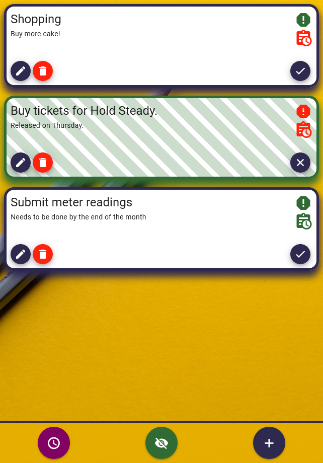
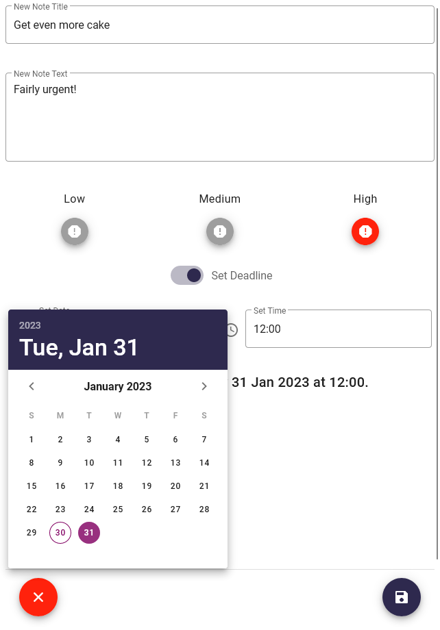

</img> 

## Project Overview

'Vue-To-Do' is a notekeeping app, with the ability to sort notes by priority and deadline.

Visit the deployed site here:
[https://vue-to-do-ae.netlify.app/](https://vue-to-do-ae.netlify.app/)

The site is built using Vue.js, with Vuex and Vuetify.
  
</img>    </img>      

